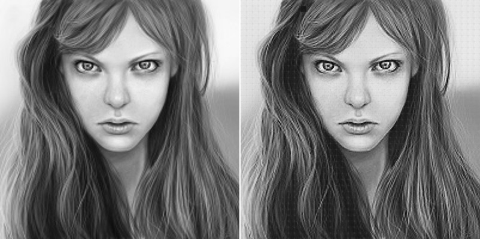
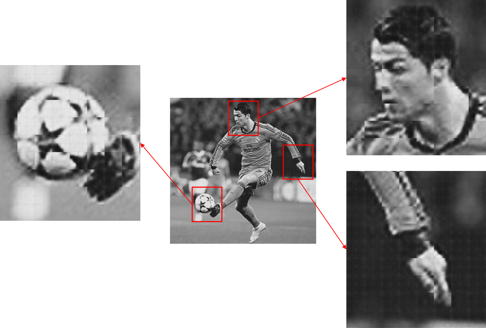
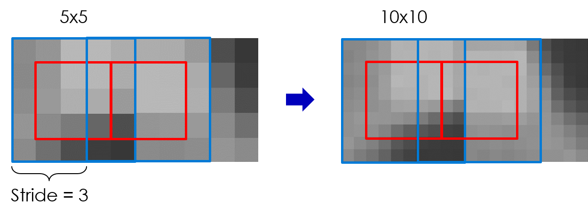
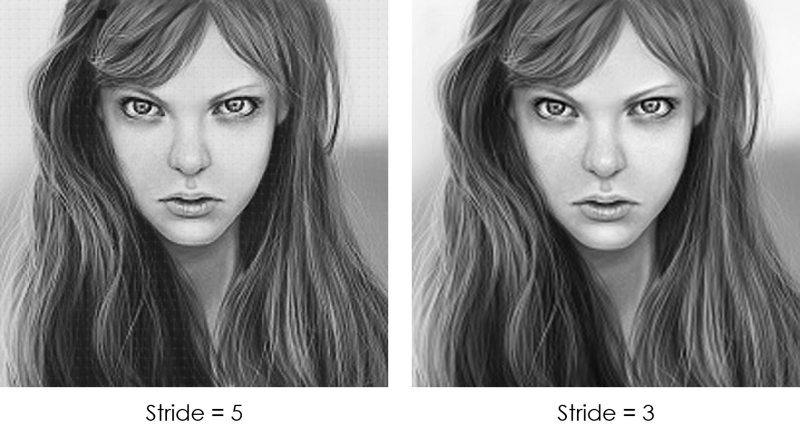

# A new approach for Image Super Resolution 
A new approach for Image Super Resolution using Convolutional Neural Networks.
## 1. Basic Idea
Sliding Window Technique: 

Input Image => 5x5 patch => Model => 10x10 patch => Full Super-Resolution Image

## 2. Problem of Sliding Window
Grid appears in the produced output.

## 3. Solution
Use smaller stride steps than the window size, and use only the center region to produce the super resolution.

The difference between stride step of 5 and 3.

Last Update in Nov. 2019

Tran Le Anh
